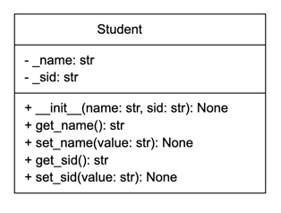
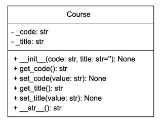
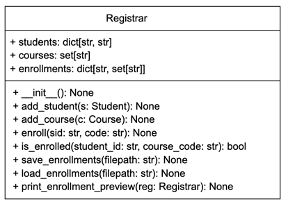

Author: Professor Lewis
Python Programming

## Student Registration

### This demo shows a student enrollment system split into two files.

#### student_registration.py

### Classes

#### Student: Holds student id and name with getters/setters and a __str__ for clear printing.

#### Course: Holds course code and title with getters/setters and a __str__.

#### Registrar: Manages registration and persistence.

    students: dict mapping sid -> name. {}

    courses: set of unique (code, title) entries. ()

    enrollments: dict mapping sid -> set of course codes. {}

    Supports saving/loading enrollments via pickle (serialize/deserialize).

#### student_registration_main.py
    Drives the program: create students and courses, enroll students, display rosters, and save/load enrollment data.

Unified Modeling Language - UML CLASS DIAGRAMS

